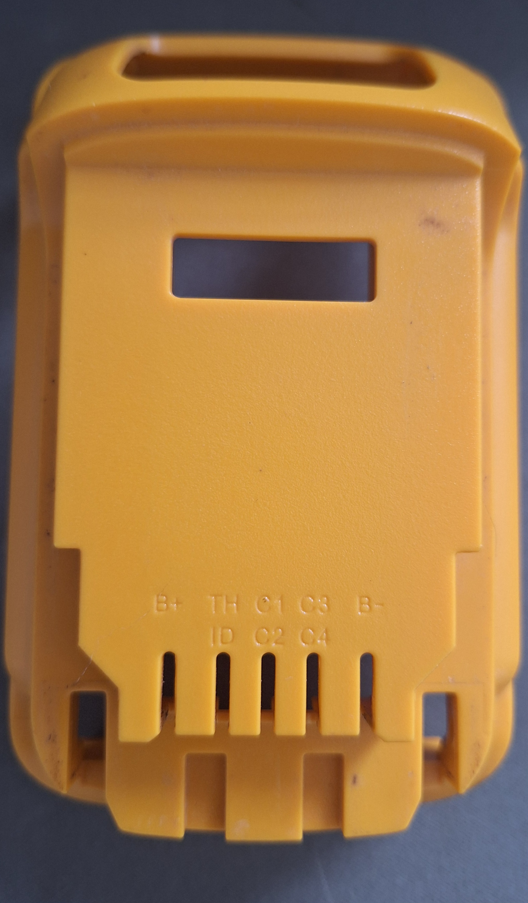
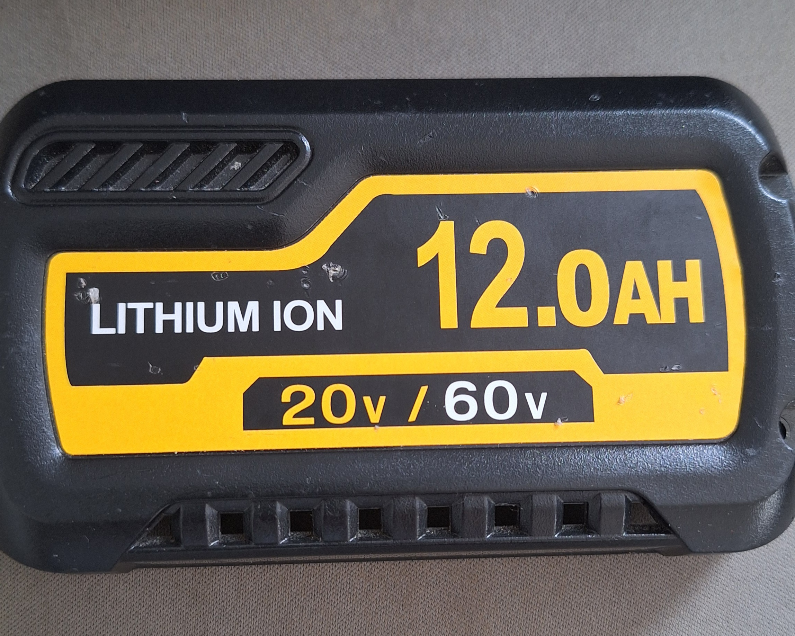
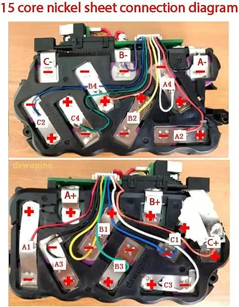
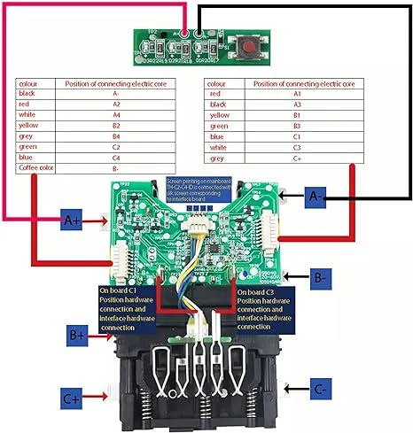

# Overview in fixing Lithium ION 12.0AH 20V/60V battery pack

Battery Pack of Interest brandless:
<!--  -->

<!--  -->


## Basics

12.0 AH refers to the capacity of the battery pack. Meaning that this specific battery pack can continuosly output 12 A(amps) for only 1 Hour. So if this pack was connected to a power tool that requires more or less current(amps) the duration will also vary accordingly.

## Pack Structure

### The Pack

This battery bank is made of 3 banks A, bank B, and bank C. Each bank is made of 5 battery cells

For example in bank A the first battery cell is from terminal A0(A- from the diagram shown below) to A1, then A1 to A2, upto A5(A+) for the fifth cell. The same goes for the other banks respectively.


NOTE: diagram shown bellow C2 and C4 are reversed

<p align="center">
    
</p>

### 20V <-> 60V function

This pack operates in a 20V and 60V configuration. These configuration change according to whether the tool that requires 60V fully compreses the leaver on the battery pack shown below.
By default the battery packs are set to 20v thanks to the three springs.

By compressing or releasing the switch(leaver) the banks are connected in series (60v) or parallel (20V-default).

<p align="center">
    
</p>


### Battery Cells

In this case the battery cells used are most likely the popular Samsung 25R 18650 Battery or something similar. According to specifications each cell has 2500 mAh capacity since there are 5 per bank that totals 12.5 AH which matches the battery pack. There voltage at fully charge is 4.2v and nominal is 3.7V making each bank a 20V bank.

The cells are considered discharged according to its Discharge Cutoff Voltage of 2.5V, and has a contiuous discharge rate of 20A(maximum current that can be drawn continuously without damaging the pack).

## Debugging

### Terminals

The terminals on this battery pack are as follows:
with C1-C4 are connected to bank A(note this could be wrong); with B- to C1 being for cell 1 and B- to B+ is for cell 1-5.

```
B+  TH  C1  C3  B-
    ID  C2  C4
```

C1= 3.7v

C2=C1+3.7v=7.4v

C3=C1+C2+3.7v=11.1v

C4=C1+C2+C3+3.7v=14.8v

B+= C1+C2+C3+C4+3.7=18.5v

### Test points

Measuring through the test points(pads) on the pcb, to check the individual voltage levels for each cell. Or measure the cells directly.

NOTE: C1 and C3 are read if low or 0v usually indicate that the Battery Management System (BMS) has detected an imbalance, a dead cell, or has entered a protection mode.


## Possible Fixes

First check connections for possiblity of a broken wire, if broken then resolder and check again.

If battery cell is discharged below discharge cutoff voltage then replace with new cells(replacing all is reocomended since the cell need to discharge a the same rate).

If some cells are discharge while other are nominal. Then jumping the pack with a fully charge pack is possible for a few seconds. Since the cell require similar to close voltage levels to run safely. 
Although replacing the cells is more ideal but more costly.

The process of balancing cells to match voltage levels within 20mV - 0.1V difference. Once balanced there is a good chance the BMS will unlock once balance is ditected, unless the BMS is the issue.

## References - Sources

### reddit:
 - [pin diagram (C2 and C4 are reversed in the img)](https://www.reddit.com/r/Dewalt/comments/x34tgw/anyone_knowshave_the_pin_diagram_of_flex_volt/#:~:text=At%2017C%20it%20should%20apparently,a%20charger%20from%20charging%20it.)
- [fixes](https://www.reddit.com/r/Dewalt/comments/18ab9vd/20v60v_flex_battery_fixes/)
- [battery help](https://www.reddit.com/r/Tools/comments/vdycux/dewalt_battery_help/)
- [labels](https://www.reddit.com/r/Tools/comments/d3rfuo/labels_on_my_20v_bauer_lithium_battery_what_do/#:~:text=C1%20through%20C4%20are%20used%20by%20the,if%20one%20of%20the%20cells%20is%20overvoltage.)

### Battery cells

- [batery store](https://www.18650batterystore.com/collections/18650-batteries/products/samsung-25r-18650)
- [digikey](https://www.digikey.com/en/products/detail/tinycircuits/ASR00050/9808766)